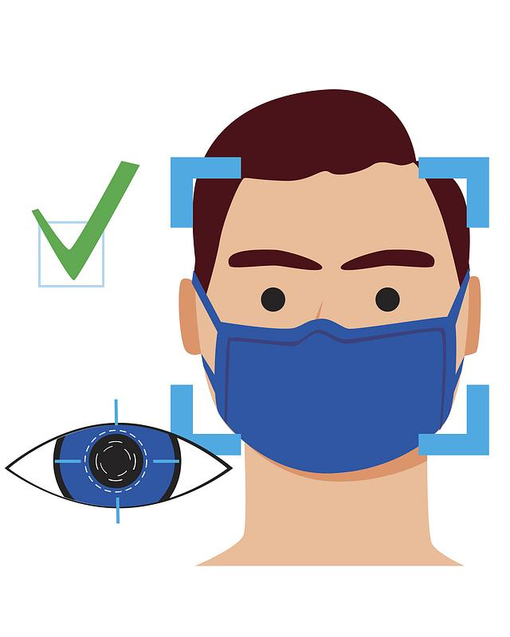
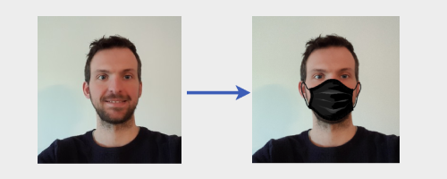
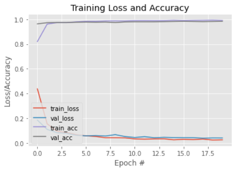

<h1 align="center">Face Mask Detection</h1>

<div align= "center">
  <h4>Face Mask Detection System built with OpenCV, Keras/TensorFlow using Deep Learning and Computer Vision concepts in order to detect face masks in static images as well as in real-time video streams.</h4>
</div>

<div align="center">
    <!-- Python version -->
    <a href="https://www.python.org/"></a>
    <!-- Last commit -->
    
    <!-- Stars -->
    
    <!-- Forks -->
    
    <!-- Open Issues -->
    <a href="https://github.com/Chaganti-Reddy/Face-Mask-Detector/issues"></a>
</div>

## :innocent: Motivation

For the ongoing COVID-19 pandemic, there are no efficient face mask detection applications which are now in high demand for transportation means, densely populated areas, residential districts, large-scale manufacturers and other enterprises to ensure safety. The absence of large datasets of **‘with_mask’** images has made this task cumbersome and challenging.

## Table of Contents

- [Features](#star-features)
- [About](#point_down-about)
- [Frameworks and Libraries](#warning-frameworks-and-libraries)
- [Datasets](#file_folder-datasets)
- [Download](#link-download)
- [Prerequisites](#key-prerequisites)
- [Installation](#-installation)
- [How to Run](#bulb-how-to-run)
- [Results](#key-results)
- [Citation](#raising_hand-citation)
- [Future Goals](#beginner-future-goals)
- [Owner](#heart-owner)
- [License](#eyes-license)

## :star: Features

- **Detection of multiple faces:** able to detect multiple faces in one frame
- **Support for detection of improper mask wearing:** our model is able to detect improper mask wearing including
  (1) uncovered chin, (2) uncovered nose, and (3) uncovered nose and mouth.
- **Alarm System for detecting without mask:** our model is able to detect improper mask and gives an alarm to alert authorities.

## :point_down: About

This app detects human faces and proper mask wearing in images and webcam streams.

Under the COVID-19 pandemic, wearing
mask has shown to be an effective means to control the spread of virus. The demand for an effective mask detection on
embedded systems of limited computing capabilities has surged, especially in highly populated areas such as public
transportations, hospitals, etc. Trained on MobileNetV2, a state-of-the-art lightweight deep learning model on
image classification, the app is computationally efficient to deploy to help control the spread of the disease.

While many work on face mask detection has been developed since the start of the pandemic, few distinguishes whether a
mask is worn correctly or incorrectly. Given the discovery of the new coronavirus variant in UK(:uk:), we aim to provide a
more precise detection model to help strengthen enforcement of mask mandate around the world.

## :warning: Frameworks and Libraries

- **[OpenCV](https://opencv.org/):** Computer vision library used to process images
- **[OpenCV DNN Face Detector](https://github.com/opencv/opencv/blob/3.4.0/samples/dnn/resnet_ssd_face_python.py):**
  Caffe-based Single Shot-Multibox Detector (SSD) model used to detect faces
- **[Tensorflow](https://www.tensorflow.org/) / [Keras](https://keras.io/):** Deep learning framework used to build and train our models
- **[MobileNet V2](https://arxiv.org/abs/1801.04381):** Lightweight pre-trained model available in Keras Applications;
  used as a base model for our transfer learning
- **[Numpy](https://numpy.org/):**
  Caffe-based Single Shot-Multibox Detector (SSD) model used to detect faces

## :file_folder: Datasets

The dataset used can be downloaded here - [Click to Download](https://drive.google.com/file/d/1QHnwvLpOHpUdhFRc9W3yIPP42iwaeIq8/view?usp=sharing)

This dataset consists of **7388** images:

- `face_no_mask`: 3,846 images
- `face_with_mask`: 3,542 images

Each image is a cropped real-world face image of unfixed sizes.

The images used were real images of faces wearing masks. The images were collected from the following sources:

- **Kaggle datasets** ([See here](https://www.kaggle.com/))
- **RMFD dataset** ([See here](https://github.com/X-zhangyang/Real-World-Masked-Face-Dataset))

```
These are some of the images of datasets.
```

|         |
| :-----------------------: |
| _Datasets with Face Mask_ |

|            |
| :--------------------------: |
| _Datasets without Face Mask_ |

### Data Preprocessing

Labeled data of masked faces is hard to come by, which is why we decided to set the overall still limited set of real masked faces that we have collected apart for validation and testing. Artificially generated masks that are used for training are generated as follows:

1. Detect the face in the image
2. Find the face landmarks, more specifically we need the location of the nose and chin
3. Apply an image of a mask to the face with the position based on the face landmarks

This strategy is based on the description that you can find in the [prajnasb/observations repository](https://github.com/prajnasb/observations).
We apply different masks with different shapes and colors to generate training data, which you can find in [dataset/mask-templates](https://github.com/Chaganti-Reddy/Face-Mask-Detector/tree/main/Face-Mask-Detector/dataset/with_mask). Below you can see an example of a mask being artificially applied.



## :link: Download

The dataset is now available [here](https://drive.google.com/file/d/1QHnwvLpOHpUdhFRc9W3yIPP42iwaeIq8/view?usp=sharing)! (December 28, 2021)

## :key: Prerequisites

All the dependencies and required libraries are included in the file <code>requirements.txt</code> [See here](https://github.com/Chaganti-Reddy/Face-Mask-Detector/blob/main/Face-Mask-Detector/requirements.txt)

## 🚀&nbsp; Installation

1. Clone the repo

```
$ git clone https://github.com/Chaganti-Reddy/Face-Mask-Detector.git
```

2. Change your directory to the cloned repo

```
$ cd Face-Mask-Detector
```

3. Now, run the following command in your Terminal/Command Prompt to install the libraries required

```
$ pip3 install -r requirements.txt

```

## :bulb: How to Run

1. Open terminal. Go into the cloned project directory and type the following command: (For training purpose only..)

```
$ python3 Training.py
```

- If you want to test directly run this command without above command..

2. To detect face masks in real-time video streams type the following command:

```
$ python3 Face_Mask_Detect.py
```

## :key: Results

#### Our model gave 98% accuracy for Face Mask Detection after training via <code>tensorflow-gpu</code>

####

</img>

#### We got the following accuracy/loss training curve plot(for less no.of attempts)

#### We will get more accuracy if we try more no.of epochs(attempts)



## :clap: And it's done!

Feel free to mail me for any doubts/query
:email: chagantivenkataramireddy1@gmail.com

---

## :raising_hand: Citation

You are allowed to cite any part of the code or our dataset. You can use it in your Research Work or Project. Remember to provide credit to the Maintainer Chaganti Reddy by mentioning a link to this repository and her GitHub Profile.

Follow this format:

- Author's name - Chaganti Reddy
- Date of publication or update in parentheses.
- Title or description of document.
- URL.

## :beginner: Future Goals

1. Integrate This Project with Voice System.
2. Creating Android and IOS application of Face-Mask-Detector
3. Improving the training of model for low end camera.
4. Adding the Email Sending feature to Face-Mask-Detector.

## :heart: Owner

Made with :heart:&nbsp; by [Chaganti Reddy](https://github.com/Chaganti-Reddy/)

## :eyes: License

MIT © [Chaganti Reddy](https://github.com/Chaganti-Reddy/Face-Mask-Detector/blob/main/LICENSE)
