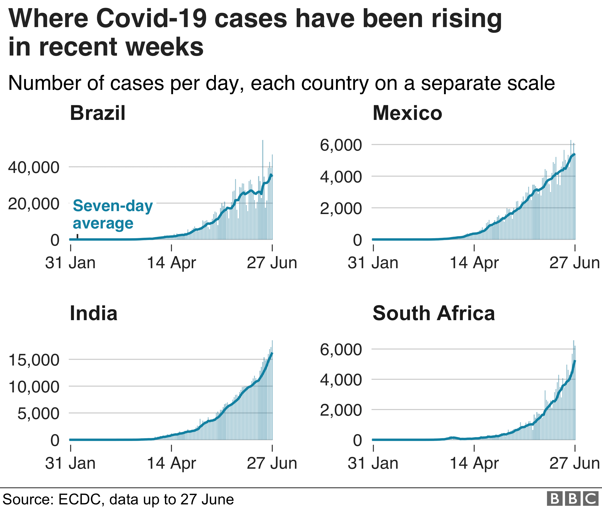

# Face-Mask-Detector

## About this project

We can see now a days the spreading of Covid-19 is incresing rapidly. So me and my team decided to make a project based on deep learning .




```
This is a simple project for Detecting the face mask of a person.
This Project is build using Face Mask Detector model and pre-existed caffemodel.

```
